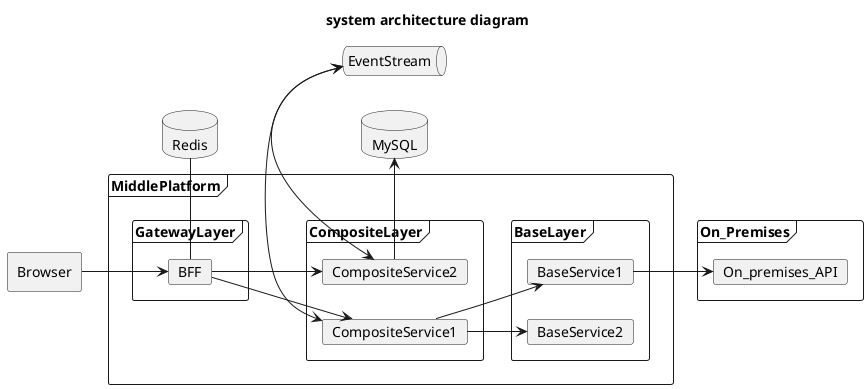
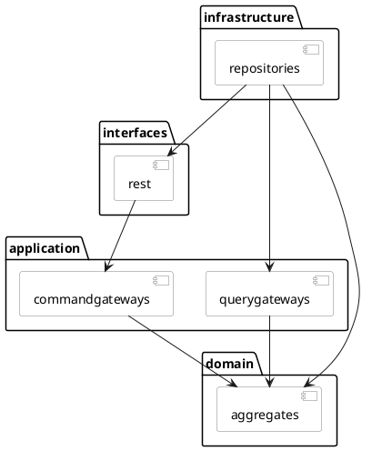

# initialize-project
Initialize project &amp; git commit style

# system architecture diagram


# Naming Conventions

## Project Name
$公司-$平台階層-$服務階層-$服務名  

ex: cat-mid-cl-enterprise  
| Abbreviation | Description |
| ---  | --- |
| cat | 有貓國際公司 |
| mid | 服務中台 |
| cl | CompositeLayer |
| enterprise | 業務服務 |
## Java Code

| Identifier Type | Rules for Naming                                                                                                                                                                                                                  | Examples                                                                        |
|-----------------|-----------------------------------------------------------------------------------------------------------------------------------------------------------------------------------------------------------------------------------|---------------------------------------------------------------------------------|
| Packages        | The prefix of a unique package name is always written in all-lowercase ASCII letters and  should be one of the top-level domain names, currently com, edu, gov, mil, net, org                                                     | com.cat.das                                                            |
| Classes         | - Class names should be noun <br> - Camel Case with the first word capitalized                                                                                                                                                         | public class ImageProcessor public class OrderConsumer                          |
| Interfaces      | like Classes                                                                                                                                                                                                                      | public interface InventorySink                                                  |
| Methods         | - Methods should be verbs - Camel Case with first letter lowercase                                                                                                                                                                | public void receive(); private OrderEvent createOrderEvent();                   |
| Variables       | - Except for variables, all instance, class, and class constants are in mixed case with a lowercase first letter.  <br> - Variable names should not start with underscore _ or dollar sign $ characters, even though both are allowed. | Order order; InventoryCheckEvent event;                                         |
| Constants       | All uppercase with words separated by underscores ("_")       

**References**  
[Google Java Style Guide](https://google.github.io/styleguide/javaguide.html)

## Database
<table>
<tr>
      <th>Identifier Type</th>
      <th>Rules for Naming</th>
      <th>Examples</th>
  </tr>

<tr>
<td>

  Table Name
</td>
<td>

  - should be written entirely in lower case <br> 
  - underscores separate words
</td>
<td>

  ```sql
  CREATE TABLE person ();
  CREATE TABLE team_member ();
  ```
</td>
</tr>

<tr>
<td>

  Field
</td>
<td>

  like Table Name rule
</td>
<td>
  
  ```sql
  CREATE TABLE user (
    id            bigint PRIMARY KEY,
    first_name     text NOT NULL,
    last_name     text NOT NULL,
    birth_date    date NOT NULL);
  ```
</td>
</tr>

<tr>
<td>

  Index
</td>
<td>

  like Table Name rule
</td>
<td>
  
  ```sql
  CREATE INDEX user_ix_first_name_last_name 
  ON user (first_name, last_name);
  ```
</td>
</tr>
</table>    

## Log level

<table>
  <tr>
      <th>Level</th>
      <th>Description</th>
      <th>Examples</th>
  </tr>

<tr>
<td>
  DEBUG
</td>
<td>

  - For development or testing env <br>
  - show more information than you'd want in normal production situations
</td>
<td>
  
  ```java
  logger.debug("Query criteria: {}, result：{}", queryParam, result);
  ```
</td>
</tr>

<tr>
<td>
  INFO
</td>
<td>

  - For testing or production env <br>
  - INFO messages correspond to normal application behavior and milestones
</td>
<td>
  
  ```java
  logger.debug("Logged in user: {}, accessToken：{}", 
      user.getName(), token);
  ```
</td>
</tr>

<tr>
<td>
  WARN
</td>
<td>

  - For developement, testing or production env <br>
  - You might have a problem and that you've detected an unusual situation
</td>
<td>
  
  ```java
  if( !event.isEnough() ) {
      log.warn("Insufficient quantity, itemId: {}, current quantity: {}",
          event.getItemId(), event.getCurrentQuantity());
      return;
  }
  ```
</td>
</tr>
<td>
  ERROR
</td>
<td>

  - For developement, testing or production env <br>
  - An ERROR represents the failure of something important going on in your application
</td>
<td>
  
  ```java
  try {
      TimeUnit.SECONDS.sleep(2);
  } catch (InterruptedException e) {
      log.error("Unexpected error", e);
      Thread.currentThread().interrupt();
  }
  ```
</td>
</tr>
</table> 

## API
[Web API 設計](https://docs.microsoft.com/zh-tw/azure/architecture/best-practices/api-design)

# Development Environment
[Set up your development environment](https://github.com/cloud-technology/initialize-project/blob/main/docs/Development_Environment.md)

# 開發流程
開發流程採用 [GitHub flow](https://guides.github.com/introduction/flow/) 進行快速迭代  
**References**   
[Gitflow](https://www.thoughtworks.com/radar/techniques/long-lived-branches-with-gitflow)

# 優雅的提交你的 Git Commit Message
[Git Commit Message Format & Lint](https://github.com/cloud-technology/initialize-project/blob/main/docs/Git-Commit.md)

# Download project template
[start.spring.io](https://start.spring.io/#!type=gradle-project&language=java&platformVersion=2.4.5.RELEASE&packaging=jar&jvmVersion=11&groupId=com.example&artifactId=demo&name=demo&description=Demo%20project%20for%20Spring%20Boot&packageName=com.example.demo&dependencies=web,native,data-rest,data-jpa,mysql,flyway,validation,actuator,lombok,prometheus,cloud-starter-sleuth,testcontainers,restdocs,cloud-contract-verifier,cloud-contract-stub-runner,cloud-feign)  

# 調整 .gitignore
可參考此專案的 [.gitignore](https://github.com/cloud-technology/initialize-project/blob/main/.gitignore)  

# Project directory
``` bash
# 需要上傳至 git
touch src/main/resources/.gitkeep
touch src/test/resources/.gitkeep
```

Springboot 使用設定檔(不會包到 jar 檔中)
``` bash
mkdir config
touch config/application-dev.yml
touch config/application-dev-secret.yml
```

說明文件
``` bash
mkdir docs
```

外部開發資源
``` bash
mkdir docker
cat << 'EOF' > docker/docker-compose.yml
version: '3.9'
services:
  mysql:
    image: 'mysql:8.0.23'
    restart: always
    command: '--default-authentication-plugin=mysql_native_password'
    ports:
      - '3306:3306'
    environment:
      MYSQL_ROOT_PASSWORD: 'pw123456'
      MYSQL_DATABASE: 'testdb'
      MYSQL_USER: 'user1'
      MYSQL_PASSWORD: 'pw123456'
    logging:
      driver: json-file
      options:
        max-size: 20m
        max-file: '2'
EOF
```

Spring 設定檔部分只上傳開發環境使用 & 有用到通訊加密兩種配置的設定檔 如下
``` .gitignore
!**/application-dev.yml
!**/application-dev-secret.yml
```

# Coding style
使用 [spotless](https://github.com/diffplug/spotless/tree/main/plugin-gradle), 
build.gradle 增加 plugins 跟配置
``` groovy
plugins {
	id 'com.diffplug.spotless' version '5.11.1' // https://github.com/diffplug/spotless/tree/main/plugin-gradle
}

spotless {
	encoding 'UTF-8' // all formats will be interpreted as UTF-8
	java {
		target 'src/**/*.java'
		removeUnusedImports()
		importOrder()
		googleJavaFormat()
	}
	sql {
		target 'src/**/*.sql'
		dbeaver()
	}
	groovyGradle {
		target '*.gradle'
		greclipse()
	}
}
```

gradle 指令
``` bash
# 編譯時期會先檢查
./gradlew build
# 依照指定方式格式化
./gradlew spotlessApply
```

# 建立需要的設定檔
src/main/resources/application.yml
``` yml
spring:
  application:
    name: initialize-project
  profiles:
    active:
    - dev
```

config/application-dev.yml
``` yml
spring:
  main:
    cloud-platform: kubernetes
    banner-mode: off 
  datasource:
    driver-class-name: com.mysql.cj.jdbc.Driver
    url: jdbc:mysql://127.0.0.1:3306/testdb?serverTimezone=UTC&useLegacyDatetimeCode=false&autoReconnect=true&useUnicode=true&characterEncoding=utf8&useSSL=false
    username: user1
    password: pw123456
    hikari:
      connection-init-sql: SET NAMES utf8mb4 COLLATE utf8mb4_unicode_ci;
  flyway:
    url: jdbc:mysql://127.0.0.1:3306
    user: root
    password: pw123456
  jpa:
    hibernate:
      ddl-auto: none
    show-sql: false

server:
  shutdown: graceful # 優雅下線
  error:
    include-message: always
    include-binding-errors: always

logging:
  level:
    root: info
    com.example.demo: debug

management:
  server:
    port: 9000
  endpoints:
    web:
      exposure:
        include: "*" # 'health, info, env, prometheus, metrics, httptrace, threaddump, heapdump, loggers'
  endpoint:
    shutdown:
      enabled: true # shutDown RestAPI, UAT 以上環境關閉
    health:
      show-details: always # 顯示詳細健康檢查, UAT 以上環境關閉
      probes:
        enabled: true
  health:
    livenessstate:
      enabled: true
    readinessstate:
      enabled: true
  info:
    git:
      mode: full
```

# Package structure
Domain-Driven Design and the Hexagonal Architecture


## 建立 service 共用 package
``` bash
export BasePackage=src/main/java/com/example/demo
mkdir -p ${BasePackage}/configuration
mkdir -p ${BasePackage}/exceptions
mkdir -p ${BasePackage}/shareddomain
```

## 建立 Bounded Context package
舉例是購物車服務 cart + ms(代稱)
``` bash
export BoundedContext=cartms
mkdir -p ${BasePackage}/${BoundedContext}
# 應用層
mkdir -p ${BasePackage}/${BoundedContext}/application/internal
mkdir -p ${BasePackage}/${BoundedContext}/application/internal/commandgateways
mkdir -p ${BasePackage}/${BoundedContext}/application/internal/querygateways
mkdir -p ${BasePackage}/${BoundedContext}/application/internal/sagamanagers
mkdir -p ${BasePackage}/${BoundedContext}/application/internal/outboundservices

# 領域層
mkdir -p ${BasePackage}/${BoundedContext}/domain
mkdir -p ${BasePackage}/${BoundedContext}/domain/model/aggregates
mkdir -p ${BasePackage}/${BoundedContext}/domain/model/entites
mkdir -p ${BasePackage}/${BoundedContext}/domain/model/valueobjects
mkdir -p ${BasePackage}/${BoundedContext}/domain/commands
mkdir -p ${BasePackage}/${BoundedContext}/domain/events
mkdir -p ${BasePackage}/${BoundedContext}/domain/queries
mkdir -p ${BasePackage}/${BoundedContext}/domain/projecttions
mkdir -p ${BasePackage}/${BoundedContext}/domain/queryhandlers

# 基礎層
mkdir -p ${BasePackage}/${BoundedContext}/infrastructure
mkdir -p ${BasePackage}/${BoundedContext}/infrastructure/repositories
mkdir -p ${BasePackage}/${BoundedContext}/infrastructure/brokers

# 介面層
mkdir -p ${BasePackage}/${BoundedContext}/interfaces
mkdir -p ${BasePackage}/${BoundedContext}/interfaces/transform
mkdir -p ${BasePackage}/${BoundedContext}/interfaces/rest/dto
mkdir -p ${BasePackage}/${BoundedContext}/interfaces/eventhandlers
```

# 進行架構驗證
1. Add library
build.gradle add archunit library
``` groovy
testImplementation 'com.tngtech.archunit:archunit:0.18.0'
```

2. Architecture rule validation
[src/test/java/com/example/demo/DemoApplicationTests.java(file_name_and_package_name_and_architecture_rule)](https://github.com/cloud-technology/initialize-project/blob/main/src/test/java/com/example/demo/DemoApplicationTests.java)

# DB 版控
[Microservice Architecture Pattern: Database per service](https://microservices.io/patterns/data/database-per-service.html)  

透過版控管理 對應的 Table Schema
[src/main/resources/db/migration/V2021.0.1__basic_schema.sql](https://github.com/cloud-technology/initialize-project/blob/main/src/main/resources/db/migration/V2021.0.1__basic_schema.sql)

# 設定 Swagger OpenAPI

1. 增加需要的套件
build.gradle
``` gradle
// Swagger
implementation 'io.springfox:springfox-boot-starter:3.0.0'
implementation 'io.springfox:springfox-swagger-ui:3.0.0'
implementation 'io.springfox:springfox-data-rest:3.0.0'
```
  
2. 增加 Swagget Config
參考 [src/main/java/com/example/demo/configuration/OpenAPIConfig.java](https://github.com/cloud-technology/initialize-project/blob/main/src/main/java/com/example/demo/configuration/OpenAPIConfig.java)  
  
3. 定義說明
AddCartProductDto.java
``` java
import javax.validation.constraints.NotBlank;

import io.swagger.v3.oas.annotations.media.Schema;
import lombok.Data;

@Data
@Schema(description = "購物車商品新增資訊")
public class AddCartProductDto {
    @NotBlank(message = "商品 ID 為必填")
    @Schema(required = true, description = "商品ID", example = "123456")
    private String productId;
    @NotBlank(message = "商品名稱為必填")
    @Schema(required = true, description = "商品名稱", example = "等身公仔")
    private String productName;
}
```

# Testcontainers for unittest
[Testcontainers](https://www.testcontainers.org/)  
  
範例程式  
[src/test/java/com/example/demo/DemoApplicationTests.java(get_cart_test)](https://github.com/cloud-technology/initialize-project/blob/main/src/test/java/com/example/demo/DemoApplicationTests.java)


