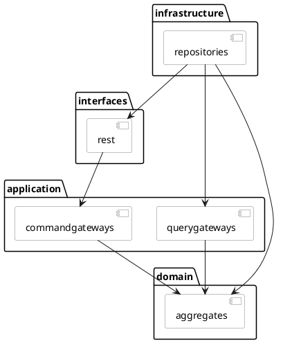

# initialize-project
Initialize project &amp; git commit style

# Development Environment
[Set up your development environment]()

# 優雅的提交你的 Git Commit Message
[Git Commit Message Format & Lint]()

# Download project template
[start.spring.io](https://start.spring.io/#!type=gradle-project&language=java&platformVersion=2.4.5.RELEASE&packaging=jar&jvmVersion=11&groupId=com.example&artifactId=demo&name=demo&description=Demo%20project%20for%20Spring%20Boot&packageName=com.example.demo&dependencies=web,native,data-rest,data-jpa,mysql,flyway,validation,actuator,lombok,prometheus,cloud-starter-sleuth,testcontainers,restdocs,cloud-contract-verifier,cloud-contract-stub-runner,cloud-feign)  

# 調整 .gitignore
可參考此專案的 [.gitignore]()  

# Project directory
``` bash
# 需要上傳至 git
touch src/main/resources/.gitkeep
touch src/test/resources/.gitkeep
```

Springboot 使用設定檔(不會包到 jar 檔中)
``` bash
mkdir config
touch config/application-dev.yml
touch config/application-dev-secret.yml
```

說明文件
``` bash
mkdir docs
```

外部開發資源
``` bash
mkdir docker
cat << 'EOF' > docker/docker-compose.yml
version: '3.9'
services:
  mysql:
    image: 'mysql:8.0.23'
    restart: always
    command: '--default-authentication-plugin=mysql_native_password'
    ports:
      - '3306:3306'
    environment:
      MYSQL_ROOT_PASSWORD: 'pw123456'
      MYSQL_DATABASE: 'testdb'
      MYSQL_USER: 'user1'
      MYSQL_PASSWORD: 'pw123456'
    logging:
      driver: json-file
      options:
        max-size: 20m
        max-file: '2'
EOF
```

Spring 設定檔部分只上傳開發環境使用 & 有用到通訊加密兩種配置的設定檔 如下
``` .gitignore
!**/application-dev.yml
!**/application-dev-secret.yml
```

# Coding style
使用 [spotless](https://github.com/diffplug/spotless/tree/main/plugin-gradle), 
build.gradle 增加 plugins 跟配置
``` groovy
plugins {
	id 'com.diffplug.spotless' version '5.11.1' // https://github.com/diffplug/spotless/tree/main/plugin-gradle
}

spotless {
	encoding 'UTF-8' // all formats will be interpreted as UTF-8
	java {
		target 'src/*/java/**/*.java'
		removeUnusedImports()
		importOrder()
		googleJavaFormat()
	}
	sql {
		target 'src/**/*.sql'
    // dbeaver()
	}
	groovyGradle {
		target '*.gradle'
		greclipse()
	}
}
```

gradle 指令
``` bash
# 編譯時期會先檢查
./gradlew build
# 依照指定方式格式化
./gradlew spotlessApply
```

# 建立需要的設定檔
src/main/resources/application.yml
``` yml
spring:
  application:
    name: initialize-project
  profiles:
    active:
    - dev
```

config/application-dev.yml
``` yml
spring:
  datasource:
    driver-class-name: com.mysql.cj.jdbc.Driver
    url: jdbc:mysql://127.0.0.1:3306/testdb?serverTimezone=UTC&useLegacyDatetimeCode=false&autoReconnect=true&useUnicode=true&characterEncoding=utf8&useSSL=false
    username: user1
    password: pw123456
    hikari:
      connection-init-sql: SET NAMES utf8mb4 COLLATE utf8mb4_unicode_ci;
  flyway:
    schemas:
    - testdb
    default-schema: testdb
    url: jdbc:mysql://127.0.0.1:3306
    user: root
    password: pw123456
  jpa:
    hibernate:
      ddl-auto: none
    show-sql: false
server:
  error:
    include-message: always
    include-binding-errors: always

logging:
  level:
    root: info
    com.example.demo: debug
```

# Package structure
Domain-Driven Design and the Hexagonal Architecture


## 建立 service 共用 package
``` bash
export BasePackage=src/main/java/com/example/demo
mkdir -p ${BasePackage}/configuration
mkdir -p ${BasePackage}/exceptions
mkdir -p ${BasePackage}/shareddomain
```

## 建立 Bounded Context package
舉例是購物車服務 cart + ms(代稱)
``` bash
export BoundedContext=cartms
mkdir -p ${BasePackage}/${BoundedContext}
# 應用層
mkdir -p ${BasePackage}/${BoundedContext}/application/internal
mkdir -p ${BasePackage}/${BoundedContext}/application/internal/commandgateways
mkdir -p ${BasePackage}/${BoundedContext}/application/internal/querygateways
mkdir -p ${BasePackage}/${BoundedContext}/application/internal/sagamanagers
mkdir -p ${BasePackage}/${BoundedContext}/application/internal/outboundservices

# 領域層
mkdir -p ${BasePackage}/${BoundedContext}/domain
mkdir -p ${BasePackage}/${BoundedContext}/domain/model/aggregates
mkdir -p ${BasePackage}/${BoundedContext}/domain/model/entites
mkdir -p ${BasePackage}/${BoundedContext}/domain/model/valueobjects
mkdir -p ${BasePackage}/${BoundedContext}/domain/commands
mkdir -p ${BasePackage}/${BoundedContext}/domain/events
mkdir -p ${BasePackage}/${BoundedContext}/domain/queries
mkdir -p ${BasePackage}/${BoundedContext}/domain/projecttions
mkdir -p ${BasePackage}/${BoundedContext}/domain/queryhandlers

# 基礎層
mkdir -p ${BasePackage}/${BoundedContext}/infrastructure
mkdir -p ${BasePackage}/${BoundedContext}/infrastructure/repositories
mkdir -p ${BasePackage}/${BoundedContext}/infrastructure/brokers

# 介面層
mkdir -p ${BasePackage}/${BoundedContext}/interfaces
mkdir -p ${BasePackage}/${BoundedContext}/interfaces/transform
mkdir -p ${BasePackage}/${BoundedContext}/interfaces/rest/dto
mkdir -p ${BasePackage}/${BoundedContext}/interfaces/eventhandlers
```

# 進行架構驗證
1. Add library
build.gradle add archunit library
``` groovy
testImplementation 'com.tngtech.archunit:archunit:0.18.0'
```

2. Architecture rule validation
[src/test/java/com/example/demo/DemoApplicationTests.java](src/test/java/com/example/demo/DemoApplicationTests.java)

# DB 版控
[Microservice Architecture Pattern: Database per service](https://microservices.io/patterns/data/database-per-service.html)  

透過版控管理 對應的 Table Schema
[src/main/resources/db/migration/V2021.0.1__basic_schema.sql](https://github.com/samzhu/2021-04-07-ddd-implementation-lab/blob/main/src/main/resources/db/migration/V1.0.0__basic_schema.sql)

# 設定 Swagger OpenAPI

1. 增加需要的套件
build.gradle
``` gradle
// Swagger
implementation 'io.springfox:springfox-boot-starter:3.0.0'
implementation 'io.springfox:springfox-swagger-ui:3.0.0'
implementation 'io.springfox:springfox-data-rest:3.0.0'
```

2. 增加 Swagget Config
參考[OpenAPIConfig.java]()  
